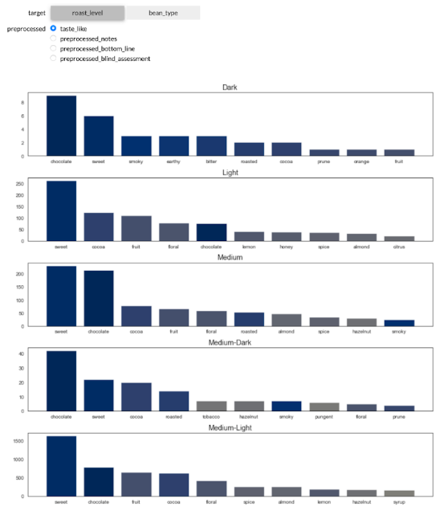

# capstone-coffee-recommendation

## Project Scope
We’ve reached peak coffee culture in America. While your local coffee shop is perfect for a mid-afternoon pick-me-up, the very best coffee in America is definitely worth traveling for. With plenty of brunch spots and bakeries to get your morning fix, we’re after the slow, loving pour-overs, the iconic America coffee houses and those that do something absolutely extraordinary with their joe.

## Technology in this project
pandas, seaborn, numpy, matplotlib, nltk, sklearn, ipywidgets, CountVectorizer

## Procedure and Project Overview

1.collecting the data 
  Data Sources: coffeereview.com 
  web scraping 1000+ coffee review in north america 
  
2.Data cleaning and EDA 
  -How were the missing values treated? 
  Price per ounces: 
  It has a lot of missing values, different currency, and units. 
3.using Linear Regression to study the correlation between price and coffee score 
4.using NLP analysis what is the coffee taste like 

## Results

the highest correlate to coffee score is acidity, it was .78. As observed,  

## The App

I maked this app by using jupyter widgets.

Let's find a coffee taste like vnillin. The coffee is CBD Coffee Dark Roast.

The top five similar coffee are Ethiopia Guji Odo Shakiso, Kona Naturals, Diima #9 Ethiopia Natural, Ethiopia Sidama Naia Bomb Natural Vertical Reserve, and Naturals With Attitude.

## Next Step

Finally, a few things were not considered when building the engine and they should deserve some attention: 
<li>
The washing technique and roaster location of the coffee was not checked. In fact, this could be important to affect coffee quality. 
<li>
another point concerns the replacement of the keywords. In some cases, it was shown that the flavor had a different meaning than the original word(green tea flavor breaks down to green and tea flavor). Only 67 flavors were defined. 
<li>
The gap between review date and roasted date. The longer the coffee sits inside the package, the quality becomes wost. 

Next step would be creating a SVD model to let people rate the coffee bean and genarate a new recommandation base on the score.
